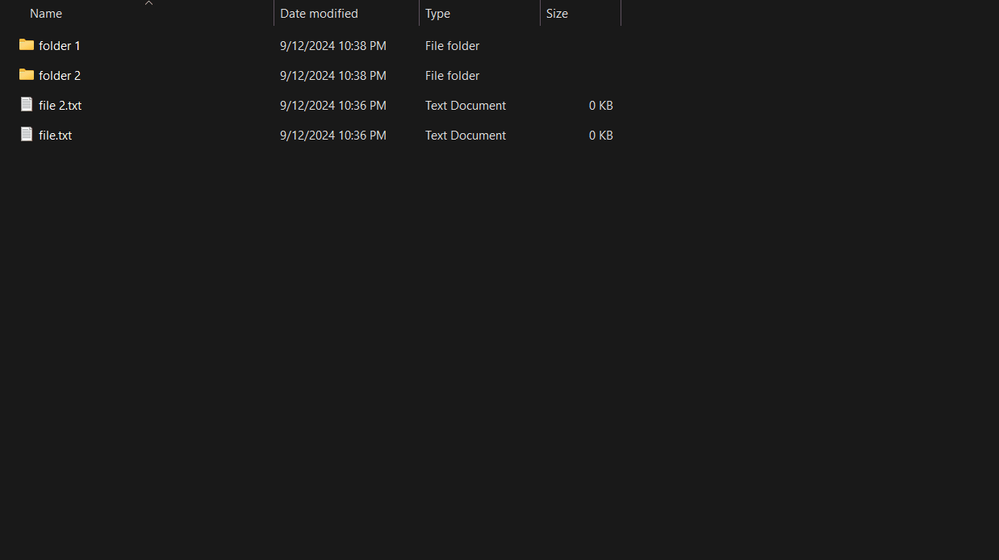
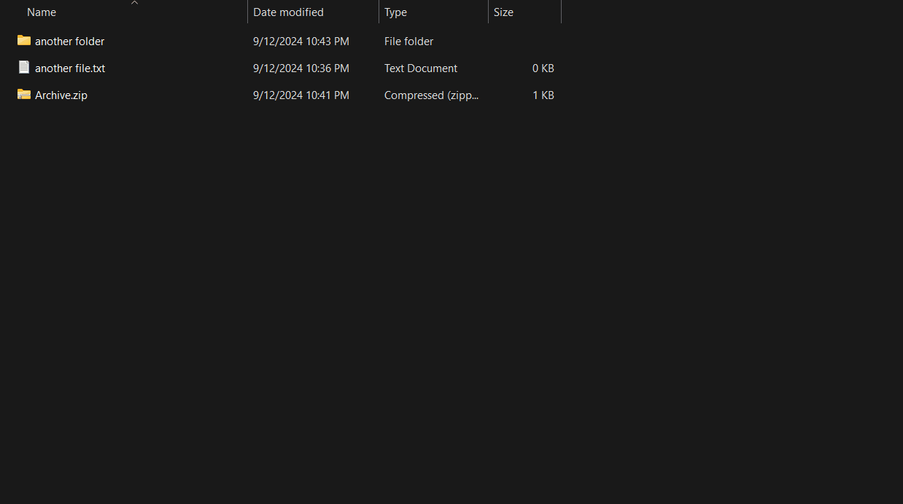

<div align="center">
<pre>
 █████╗ ██╗   ██╗████████╗ ██████╗ ██╗  ██╗ ██████╗ ████████╗██╗  ██╗███████╗██╗   ██╗
██╔══██╗██║   ██║╚══██╔══╝██╔═══██╗██║  ██║██╔═══██╗╚══██╔══╝██║ ██╔╝██╔════╝╚██╗ ██╔╝
███████║██║   ██║   ██║   ██║   ██║███████║██║   ██║   ██║   █████╔╝ █████╗   ╚████╔╝ 
██╔══██║██║   ██║   ██║   ██║   ██║██╔══██║██║   ██║   ██║   ██╔═██╗ ██╔══╝    ╚██╔╝  
██║  ██║╚██████╔╝   ██║   ╚██████╔╝██║  ██║╚██████╔╝   ██║   ██║  ██╗███████╗   ██║   
╚═╝  ╚═╝ ╚═════╝    ╚═╝    ╚═════╝ ╚═╝  ╚═╝ ╚═════╝    ╚═╝   ╚═╝  ╚═╝╚══════╝   ╚═╝   

 █████╗ ██████╗ ██╗  ██╗██╗██╗   ██╗███████╗
██╔══██╗██╔══██╗██║  ██║██║██║   ██║██╔════╝
███████║██████╔╝███████║██║██║   ██║█████╗ 
██╔══██║██╔══██╗██╔══██║██║╚██╗ ██╔╝██╔══╝ 
██║  ██║██║  ██║██║  ██║██║ ╚████╔╝ ███████╗
╚═╝  ╚═╝╚═╝  ╚═╝╚═╝  ╚═╝╚═╝  ╚═══╝  ╚══════╝

███████╗██╗  ██╗ ██████╗ ██████╗ ████████╗ ██████╗██╗   ██╗████████╗███████╗
██╔════╝██║  ██║██╔═══██╗██╔══██╗╚══██╔══╝██╔════╝██║   ██║╚══██╔══╝██╔════╝
███████╗███████║██║   ██║██████╔╝   ██║   ██║     ██║   ██║   ██║   ███████╗
╚════██║██╔══██║██║   ██║██╔══██╗   ██║   ██║     ██║   ██║   ██║   ╚════██║
███████║██║  ██║╚██████╔╝██║  ██║   ██║   ╚██████╗╚██████╔╝   ██║   ███████║
╚══════╝╚═╝  ╚═╝ ╚═════╝ ╚═╝  ╚═╝   ╚═╝    ╚═════╝ ╚═════╝    ╚═╝   ╚══════╝
</pre>
<div align="right">

AutoHotkey shortcuts for creating & extracting an arhive

Bonus: shorcut for `open with VS code`

By [Teodor Neagoe](https://github.com/Teoneag)

</div>
</div>

## Functions Preview

| Arhive example | Unzip example |
|----------------|---------------|
|  |  |


## Getting Started

### 0. Prerequisites

- Os: Windows
- [AutoHotkey v2](https://www.autohotkey.com/v2/)

### 1. Clone the repository

```bash
git clone https://github.com/Teoneag/AutoHotkey-Arhive-Shortcuts
```

### 2. Usage

- To use, simply double-click the desired `.ahk` file.
- If you want the shortcuts to remain available even after restarting Windows, copy the desired `.ahk` file to the Windows Startup folder.
  - To locate this folder, press `Windows + R` to open the Run dialog box, then type:
    ```
    shell:startup
    ```

## Features

### 1. Create arhive shortcut: `Ctrl + Shift + e`

### 2. Extract arhive shortcut: `Ctrl + e`

### 3. Open with code shortcut: `Ctrl + Shift + c`

## Plan -> Actual: 

Chronological order. Planned time -> actual time
- make the arhive creator in a smarter way
- rename folder + improve readme
- shortcut for open with code
- make the open with code open the selected folder, and if not the opened folder in file explorer
- fix readme

## ToDo

- make open with code work directly, without lunching cmd

## Special Thanks

Special thanks to [Casian](https://github.com/ChiriacCasian) for inspiring me to do this project. To view his version, click [here](https://github.com/ChiriacCasian/AHK_custom_shortcuts/tree/main)
